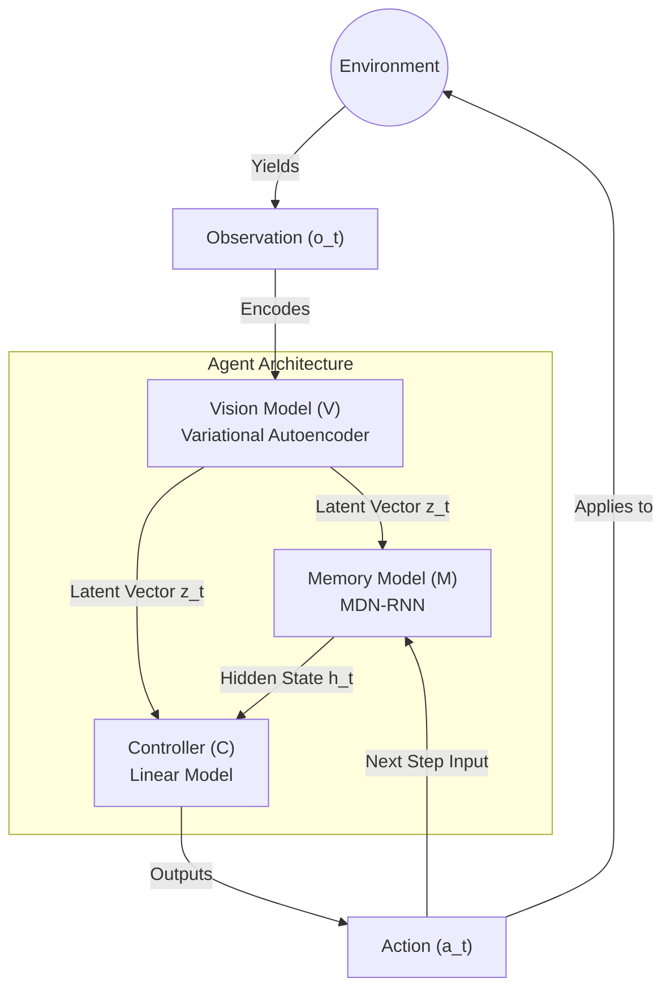

# World Models
World Models is an experimental implementation of the concepts from the "World Models" paper by David Ha and Jürgen Schmidhuber. This repository details an approach using a Variational Autoencoder (VAE) and a Recurrent Neural Network (RNN) for latent space environment simulation. The project encompasses the components needed to effectively understand and navigate an environment.

Reference Paper: [World Models (Ha and Schmidhuber, 2018)](https://arxiv.org/abs/1803.10122)

## Model Architecture
`model/vae.py` and `model/controller.py`

The agent is composed of three components working together to effectively understand and navigate an environment. The implementation adheres to the World Models design, incorporating:

*   **Vision Model (V)**: A Variational Autoencoder (VAE) that compresses high-dimensional observations (e.g., image frames) into a low-dimensional latent vector containing the essential spatial features.
*   **Memory Model (M)**: An MDN-RNN (Mixture Density Network - Recurrent Neural Network) that integrates historical information to predict future latent states based on previous actions and states.
*   **Controller (C)**: A simple fully connected neural network (linear model) that maps both the vision and memory representations to specific actions.

The following diagram illustrates the data flow through the model:

## Training & Finetuning
`train_vae.py`, `train_rnn.py`

The project implements a multi-stage pipeline for model development. The core architecture and training scripts are functional, and the model weights will be trained shortly.

*   **Vision Model Training (`train_vae.py`)**: Responsible for training the VAE to compress high-dimensional observations into latent vectors.
*   **Memory Model Training (`train_rnn.py`)**: Trains the MDN-RNN to predict the next latent state given the current state and action.

Note on Compute: The scripts are fully functional and tested on small subsets of data. Full-scale training of the curriculum is deferred, and the model weights will be trained shortly. 

## Dataset
`generate.py`

The `generate.py` script is used to interact with the environment and collect rollouts, generating the necessary datasets of observations, actions, and rewards needed to train the Vision and Memory models.

## Design Philosophy
World Models is aimed at improving understanding of latent space environment simulation. The project prioritizes clear, readable implementations of core components such as the VAE, MDN-RNN, and Controller, making these ideas easier to study and modify without the overhead of massive, complex codebases.
>>>>>>> 9f59432 (updated readme)
